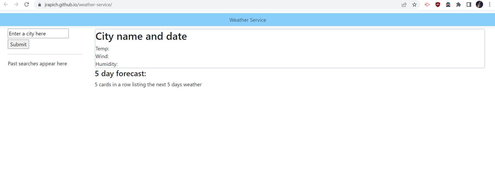

# Weather Service - a remote weather API demonstrator

## Description
Weather Service is a simple application that uses the Open Weather API to do a simple search for current and future weather conditions  of a city.  

It uses javascript and jQuery to interact with the Open Weather API, and append/remove results on the page. It will show the current weather conditions of a city the user will search for, as well as a basic weather forecast for the next 5 days.

## Installation
no installation needed

## Usage
To use this app, simply load the page from here: [https://jrapich.github.io/weather-service/](https://jrapich.github.io/weather-service/) 

Search for any city in the search field, and see a list of current weather conditions appear, as well as  some cards that will show the weather in that location in the next 5 days. The  past 5 cities you have searched for will also appear on the page.

Link to project repository: [https://github.com/jrapich/weather-service](https://github.com/jrapich/weather-service)

## Tests
none needed

## Credits
none

## Contributing
How to contribute:

Please reach out to me at jeremysr@protonmail.com or make a pull request at 

[https://github.com/jrapich/weather-service](https://github.com/jrapich/weather-service)

## Questions?
Any further questions, comments, or bug reports, can be sent to me at jeremysr@protonmail.com

https://www.github.com/jrapich

## License
This project protected under MIT License.

All rights reserved. See /LICENSE for more information.
